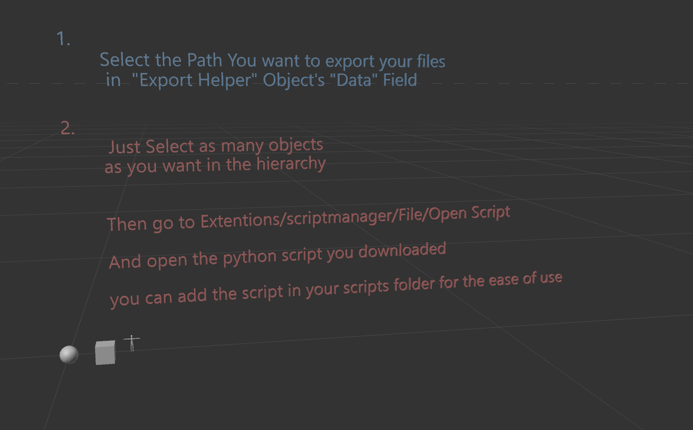

# Cinema4d-Fbx-Batch-Exporter

Export Batch of fbx files with one click

Use The Helper Scene File To See How It Works.

It is mostly useful for gamedevelopers to export multiple fbx files to unity or unreal.
